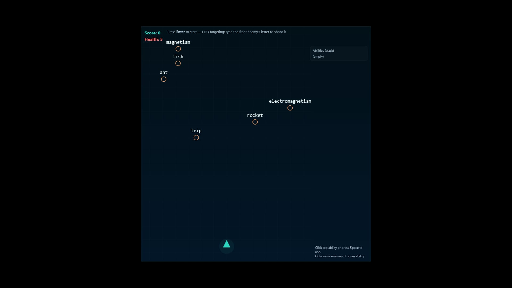

## Live Demo
https://yanyaneytin.github.io/DC101_Game_MayolGodwinChristian/

# WordBlaster 🎮

## Description
WordBlaster is a browser-based typing shooter game inspired by arcade-style
gameplay. Players eliminate enemies by typing the correct letters while
managing a stack-based ability system. The game increases in difficulty over
time, challenging speed and accuracy.

## Technologies Used
- HTML5 (Canvas)
- CSS3
- JavaScript
- Git & GitHub

## How to Run the Game
1. Clone or download the repository
2. Open `index.html` in any modern web browser
3. Press **Enter** to start the game

## How to Play
- Press **Enter** to start, pause, or resume
- Type the first letter of the front enemy to shoot
- Press **Space** to activate the top ability
- Avoid enemies reaching the bottom of the screen

## Screenshot

## References
This project is an original work created for DC 101 – Web Development.
Gameplay inspiration is based on classic typing arcade games (e.g., ZType), 
emphasizing speed, accuracy, and real-time player interaction.

